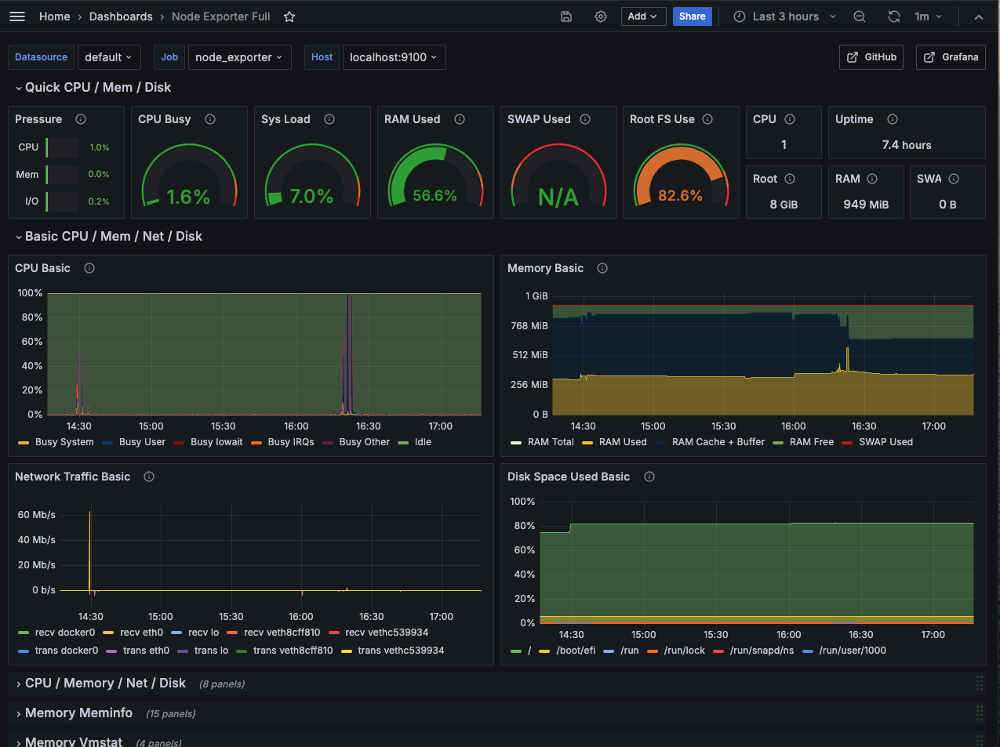
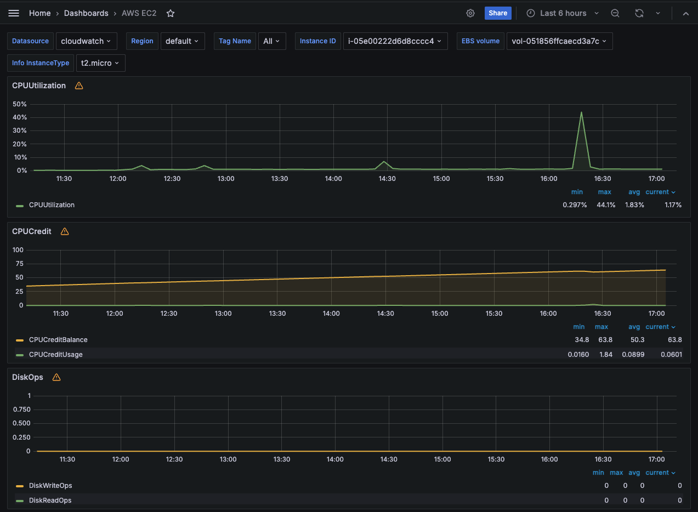

# [Descomplicando o Prometheus](https://www.linuxtips.io/course/descomplicando-prometheus) - O Treinamento

## DAY-4

### O que iremos ver hoje?

O Grafana é uma ferramenta sensacional demais, impossível alguém não conhecer, e mais impossível ainda alguém não gostar.

Mas o que é esse tal de Grafana?

O Grafana é um projeto open source, e é mantido pela empresa Grafana Labs, empresa sueca e que hoje já possuem diferentes produtos, como o Grafana Cloud, Loki, Tempo, etc.

O Grafana é uma poderosa aplicação web que nos permite visualizar, em tempo real e com dashboards incríveis, os dados de diversas fontes, como por exemplo o Prometheus.

Basicamente o Grafana permite que você crie queries super elaboradas para consultar os dados em TSDBs, como o Prometheus, e depois criar dashboards e alertas incríveis.

O Grafa é uma ferramenta que eu uso muito, e que eu recomendo muito, mesmo que você não tenha o Prometheus, o Grafana pode usar dados de diversas fontes, como por exemplo o MySQL, o PostgreSQL, o MongoDB, etc.

## Comandos utilizados

sudo apt-get install -y adduser libfontconfig1 musl

wget https://dl.grafana.com/oss/release/grafana_10.4.2_amd64.deb

sudo dpkg -i grafana_10.4.2_amd64.deb

sudo systemctl enable grafana-server

sudo systemctl start grafana-server

sudo systemctl status grafana-server

*Dashboard Node Exporter*

*Dashboard Cloudwatch*

